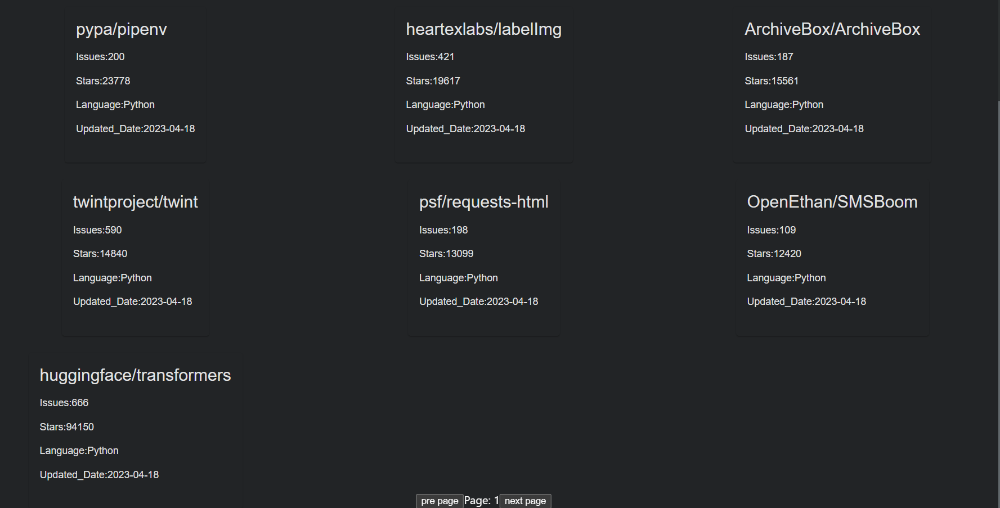
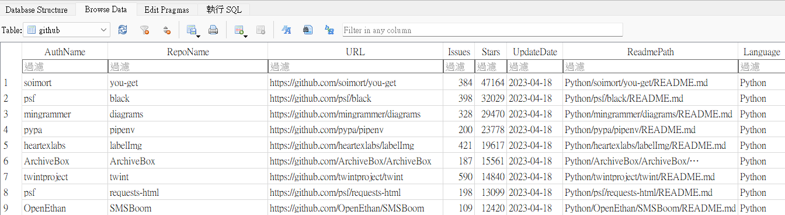

## 使用方法
安裝所需套件
```
npm install 
npm install react react-dom axios react-router-dom
npm install --save-dev @types/react

```
開啟server
```
npm start
```
需要注意這只是前端模板，後端放在[這裡](https://github.com/IceTeaOxO/pygithub-API)，要先開啟後端後前端才能正常收到資料。
## 專案介紹

該專案透過簡單的UI將GitHub repository整理成一個個Card，並在每頁顯示10個Card，可以透過換頁來獲取資料庫中新的Data。

## UI介面


## 資料庫資料
